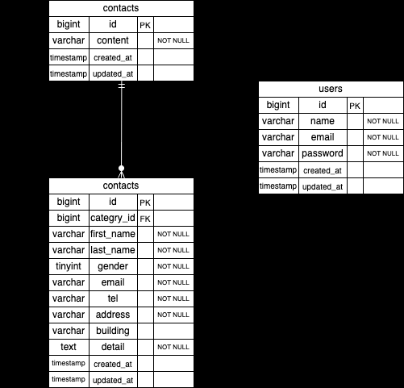

# お問い合わせフォーム（確認テスト）

## 環境構築

### Dockerビルド
1. リポジトリをクローン
   git clone git@github.com:riichikawashima-cmd/kawashimariichi-kadai1.git

2. Dockerコンテナを起動
   docker-compose up -d --build

### Laravel環境構築
1. PHPコンテナに入る
   docker-compose exec php bash

2. パッケージインストール
   composer install

3. 環境変数ファイル作成
   cp .env.example .env

4. アプリケーションキー生成
   php artisan key:generate

5. マイグレーション実行
   php artisan migrate

6. シーディング実行
   php artisan db:seed

## データベース初期データ

- contactsテーブル
  Factoryを使用してダミーデータを35件作成しています。

- categoriesテーブル（お問い合わせの種類）
  Seederを使用して以下5件のデータを作成しています。
  1. 商品のお届けについて
  2. 商品の交換について
  3. 商品トラブル
  4. ショップへのお問い合わせ
  5. その他

## ER図
お問い合わせ内容を管理するため、users・contacts・categoriesの3テーブルで構成しています。

## URL
- お問い合わせフォーム：http://localhost
- 確認ページ：http://localhost/confirm
- ユーザー登録：http://localhost/register
- ログイン：http://localhost/login
- 管理画面：http://localhost/admin
- phpMyAdmin：http://localhost:8080

## 使用技術（実行環境）
- PHP 8.1
- Laravel 8.x
- Laravel Fortify（認証）
- MySQL
- nginx
- Docker / docker-compose

## 実装機能

- お問い合わせフォーム入力・確認・送信
- バリデーション（FormRequest使用）
- お問い合わせ内容のDB保存
- 管理画面でのお問い合わせ一覧表示
- 検索機能（名前・メール・性別・種類・日付）
- お問い合わせ削除機能
- CSVエクスポート機能
- ユーザー登録・ログイン（Laravel Fortify使用）